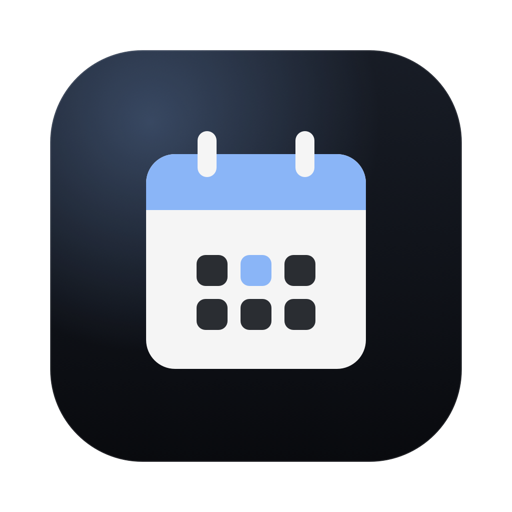
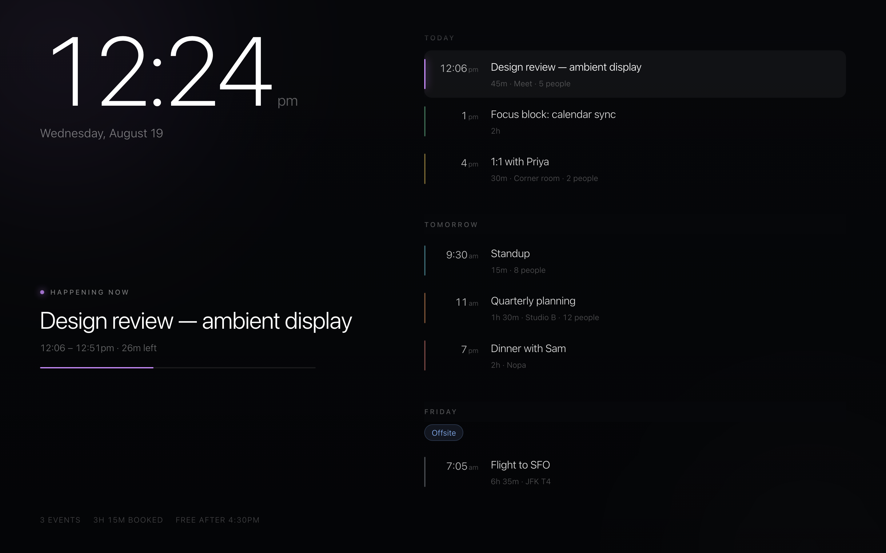
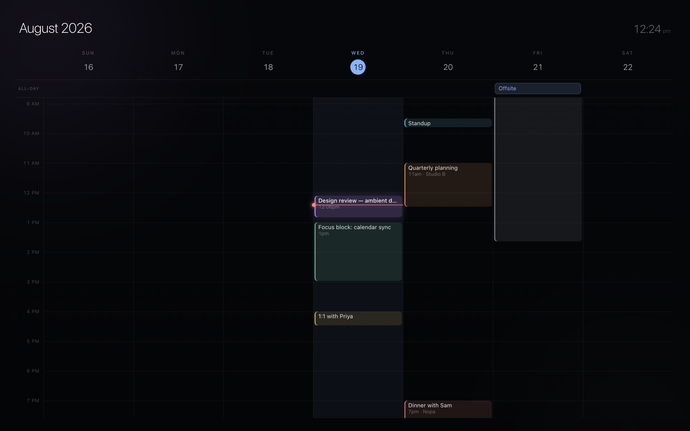
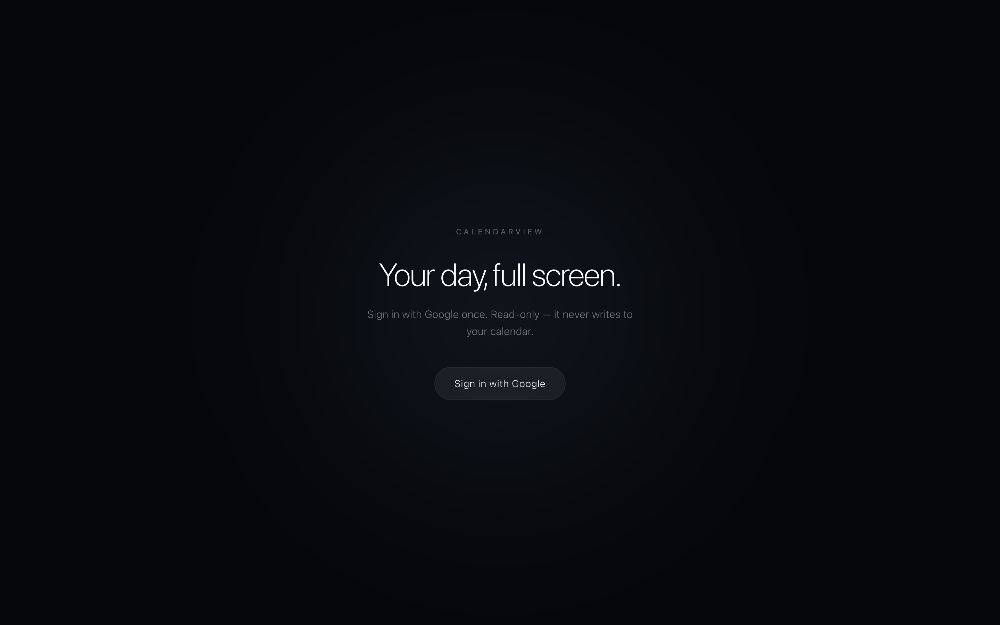

<div align="center">



# CalendarView

**Your day, full screen.**

[](https://github.com/srikarvela/calendarview/releases/latest)
&nbsp;
[](#)

</div>

<div align="center">
<table>
<tr>
<td align="center" width="150"><sub><b>KIND</b></sub><br><br><b>Universal</b><br><sub>Apple Silicon · Intel</sub></td>
<td align="center" width="150"><sub><b>VERSION</b></sub><br><br><b>1.1.0</b><br><sub>August 2026</sub></td>
<td align="center" width="150"><sub><b>REQUIRES</b></sub><br><br><b>macOS 11</b><br><sub>or later</sub></td>
<td align="center" width="150"><sub><b>CATEGORY</b></sub><br><br><b>Productivity</b><br><sub>Calendar</sub></td>
<td align="center" width="150"><sub><b>LANGUAGE</b></sub><br><br><b>EN</b><br><sub>English</sub></td>
<td align="center" width="150"><sub><b>SIZE</b></sub><br><br><b>1.1</b><br><sub>MB</sub></td>
</tr>
</table>
</div>

<br>

<div align="center">


&nbsp;&nbsp;


<sub>Day view · Week view — shown with demo data</sub>

</div>

<br>

💻 &nbsp;**Mac**

CalendarView turns a spare screen into a calendar you can read from across the room. Launch it,
sign in with Google once, and it stays in sync — no toolbars, no tabs, no buttons. Just the time,
what is happening now, and what is coming next, in a dark palette that sits quietly in a room at
night.

There is no server and no account to create. The app runs the Google sign-in itself, keeps the
refresh token in your macOS Keychain, and talks to the Google Calendar API directly. Nothing is
hosted, nothing is deployed, and no data passes through anyone else's machine.

It ships two views and nothing else. **Day** is the ambient one: an oversized clock, the event
you are in the middle of with a progress bar running under it, and the rest of the week listed
beneath. **Week** is the precise one: a seven-column time grid with overlapping events packed
side by side and a live line tracking the current minute — the layout Google Calendar uses,
rebuilt for a dark screen.

It lives in the menu bar as today's date. Click it and the display opens fullscreen.

<sub>**Read-only** — CalendarView asks for `calendar.readonly` and never writes to your calendar.
No analytics, no third-party services. Your events go from Google to your screen and nowhere
else.</sub>

---

## Install

Download [`CalendarView-1.1.0.dmg`](https://github.com/srikarvela/calendarview/releases/latest),
open it, drag **CalendarView** to Applications.

The app is signed ad-hoc rather than with a paid Apple Developer certificate, so the first launch
needs one extra step: **right-click the app → Open → Open**. macOS remembers the choice. (Plain
double-clicking shows "unidentified developer" and refuses.) Same steps on Intel and Apple
Silicon — the binary is universal.

Then launch it and press **Sign in with Google**.

<div align="center"></div>

## Set up Google sign-in (once)

Google will not let *any* application read a calendar without an OAuth client registered to a
Google account. That client cannot be shipped inside a public download, so you create one once —
it takes about two minutes — and bake it into your own build. After that, neither Mac ever asks
you for anything again.

**1.** In the [Google Cloud Console](https://console.cloud.google.com), create a project and
enable the **Google Calendar API**.

**2.** Under **APIs & Services → Credentials**, create an **OAuth client ID** with application
type **iOS**, and give it the bundle ID:

```
com.calendarview.app
```

iOS-type clients are what Apple's `ASWebAuthenticationSession` needs — they use a redirect scheme
instead of a URL, and they carry no client secret. This is the same flow Google's own macOS
sign-in uses.

**3.** Under **APIs & Services → OAuth consent screen → Audience**, add your own Gmail address
as a **Test user**.

**4.** Build the app with your client ID:

```bash
echo "YOUR-ID.apps.googleusercontent.com" > macapp/client_id.txt
./macapp/build.sh
```

That writes `macapp/build/CalendarView.dmg` with the client ID compiled in. Install it on as
many of your own Macs as you like — each one just needs its own **Sign in with Google**.

`client_id.txt` is gitignored, so it never lands in the repo.

<sub>A build made without a client ID still runs — it asks for one the first time you press sign
in, and remembers it. That is the fallback for the download above, not the intended path.</sub>

## Keyboard

The interface has no visible controls, so everything is a key.

| Key | |
| --- | --- |
| <kbd>D</kbd> | Day view |
| <kbd>W</kbd> | Week view |
| <kbd>←</kbd> <kbd>→</kbd> | Previous / next week |
| <kbd>T</kbd> | Back to today |
| <kbd>R</kbd> | Refresh now |
| <kbd>F</kbd> | Fullscreen |

The cursor and the few remaining hints fade out after three seconds of stillness. The calendar
re-syncs every five minutes, and on demand from the menu bar.

## Working on it

The interface is a React app bundled into the `.app`. To iterate on the design without building
the Mac app or touching a Google account:

```bash
npm install
npm run dev
```

- <http://localhost:3000> — the display, against demo data
- <http://localhost:3000/?view=week> — straight to the week grid
- <http://localhost:3000/?gate=1> — the sign-in screen

`npm run build:web` bundles the same UI into `macapp/Resources/web/`; `./macapp/build.sh` does
that for you and then compiles the app.

Building the Mac app needs only the Xcode **Command Line Tools**
(`xcode-select --install`) — no Xcode, no developer account. Both architectures compile in one
pass, so a DMG built on an M-series Mac runs on an Intel one unchanged.

## How it is put together

| | |
| --- | --- |
| `macapp/Sources/main.m` | The app: menu bar, OAuth, Keychain, Calendar sync, WebView bridge |
| `macapp/build.sh` | Universal build → `.app` → `.dmg`, client ID baked in |
| `src/native/main.tsx` | Entry point for the UI running inside the app |
| `src/lib/source.ts` | Native bridge, and the demo source used by `npm run dev` |
| `src/components/Display.tsx` | Clock, agenda, view switching, idle handling |
| `src/components/WeekView.tsx` | The seven-day time grid |
| `src/lib/layout.ts` | Overlap packing, day clipping, all-day resolution |

The Mac app is plain Objective-C (AppKit + WebKit) so it builds anywhere with Command Line Tools.
The UI is React 19 and Tailwind v4, bundled with esbuild. Next.js is used only as the development
harness — it is not part of the shipped app.

Sign-in uses OAuth 2.0 with PKCE through `ASWebAuthenticationSession`, so credentials are only
ever entered in Apple's own Safari-backed window; CalendarView never sees your password. The
refresh token is stored in the Keychain and the access token is refreshed as it expires.

Recurring events are expanded by Google (`singleEvents`), every calendar you have selected is
merged and colour-matched, declined invitations are dropped, all-day events use Google's
exclusive end date, results are paginated so a busy week is never truncated, and events crossing
midnight are clipped per day.
